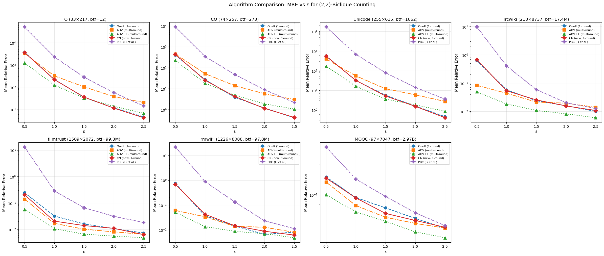
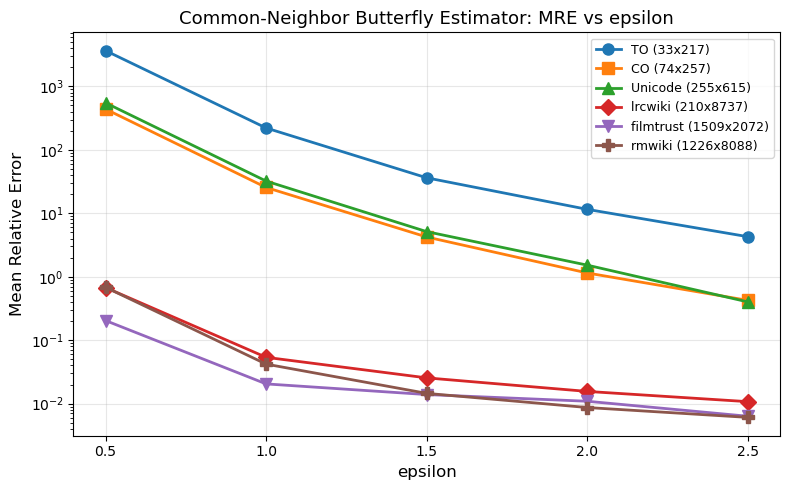
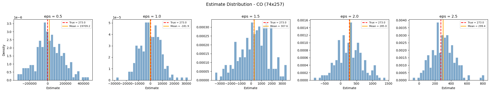
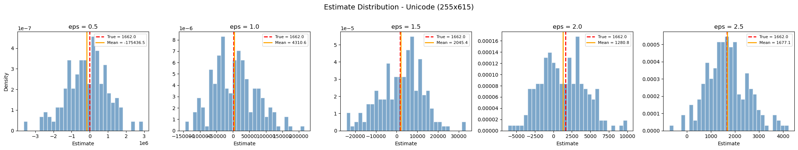
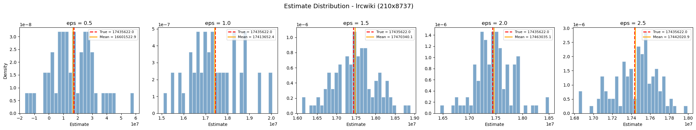
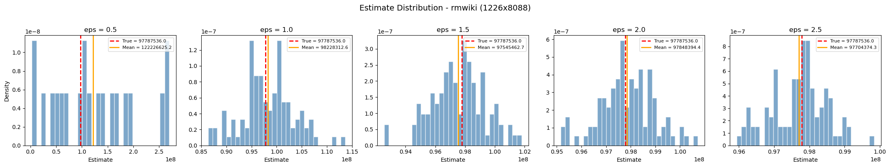
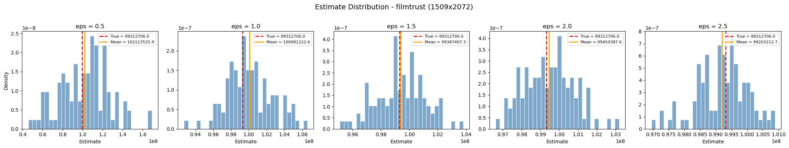
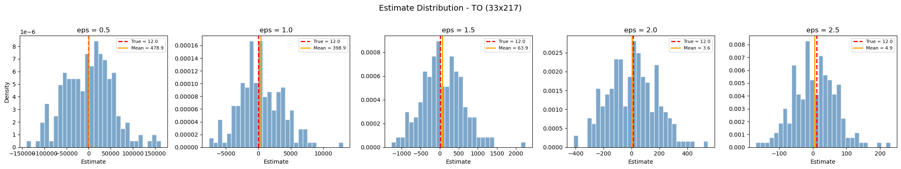

# ldp-pq: (p,q)-Biclique Counting under Edge-Local Differential Privacy

## Overview

ldp-pq is a C++ project for (p,q)-biclique counting in bipartite graphs with edge-local differential privacy (LDP). We implement and compare five algorithms:

| Algorithm | Description |
|-----------|-------------|
| **OneR** | One-round algorithm (feasible on smaller datasets) |
| **ADV** | Multi-round advanced algorithm |
| **ADV++** | Multi-round advanced algorithm with multi-center optimization + refined noisy graph construction |
| **CN** | Common-neighbor based estimator (new, one-round) |
| **PBC** | Baseline from Li et al. |

## Project Structure

- `main.cpp` — Entry point
- `biclique.cpp` / `biclique.h` — Biclique counting algorithms under edge LDP
- `bigraph.cpp` / `bigraph.h` — Bipartite graph data structures
- `utility.cpp` / `utility.h` — Shared utility functions
- `exactcounting/` — Exact biclique counting code
- `include/` — Additional header files
- `makefile` — Build script

## Build

```bash
make clean && make
```

## Usage

```bash
./biclique <epsilon> <data_directory> <num_iterations> <algorithm_switch> <p> <q>
```

### Parameters

| Parameter | Description | Example |
|-----------|-------------|---------|
| `epsilon` | Privacy budget for edge-LDP | `1.0` |
| `data_directory` | Path to dataset | `../bidata/unicode` |
| `num_iterations` | Number of rounds | `10` |
| `algorithm_switch` | Algorithm selector (see below) | `4` |
| `p`, `q` | Biclique size parameters | `2 2` |

### Algorithm Switch

- `0` — Naive algorithm
- `1` — OneR (one-round)
- `2` — MRCN algorithm
- `3` — MRCN + Multi-center optimization
- `4` — MRCN + Multi-center + Refined Noisy Graph (ADV++)

### Examples

```bash
# Naive algorithm, (2,3)-bicliques, eps=1, dataset "to", 1 round
./biclique 1 ../bidata/to 1 0 2 3

# OneR, (3,2)-bicliques, eps=1, dataset "to", 10 rounds
./biclique 1 ../bidata/to 10 1 3 2

# ADV++, (3,2)-bicliques, eps=1, dataset "unicode", 10 rounds
./biclique 1 ../bidata/unicode 10 4 3 2
```

## Data Format

### Edge List (`<datafile>.e`)

```
<upper_vertex> <lower_vertex>
```

### Metadata (`<datafile>.meta`)

```
<upper_vertices_count>
<lower_vertices_count>
<edges_count>
```

---

## Experiment Results: Algorithm Comparison

We compare all five algorithms across 7 real-world bipartite graph datasets at varying privacy budgets ε ∈ {0.5, 1.0, 1.5, 2.0, 2.5}, counting (2,2)-bicliques (butterflies). Each experiment runs 200 iterations. The metric is **Mean Relative Error (MRE)**.

### Datasets

| Dataset | Upper × Lower | Edges | True Butterfly Count |
|---------|--------------|-------|---------------------|
| TO | 33 × 217 | — | 12 |
| CO | 74 × 257 | 328 | 273 |
| Unicode | 255 × 615 | 1,255 | 1,662 |
| lrcwiki | 210 × 8,737 | — | 17.4M |
| filmtrust | 1,509 × 2,072 | — | 99.3M |
| rmwiki | 1,226 × 8,088 | — | 97.8M |
| MOOC | 97 × 7,047 | — | 2.97B |

### MRE Comparison (ε = 1.0)

| Dataset | OneR | ADV | ADV++ | CN | PBC |
|---------|-----:|----:|------:|---:|----:|
| TO | 224.60 | 324.04 | 125.30 | 220.66 | 2296.39 |
| CO | 27.05 | 52.18 | 18.18 | 25.48 | 344.34 |
| Unicode | 31.48 | 54.40 | 16.20 | 32.13 | 686.19 |
| lrcwiki | 0.06 | 0.04 | **0.02** | 0.05 | 0.41 |
| filmtrust | 0.03 | 0.02 | **0.01** | 0.02 | 0.29 |
| rmwiki | 0.04 | 0.03 | **0.01** | 0.04 | 0.88 |
| MOOC | 0.01 | 0.01 | **0.01** | 0.01 | 0.02 |

### MRE Comparison (ε = 2.0)

| Dataset | OneR | ADV | ADV++ | CN | PBC |
|---------|-----:|----:|------:|---:|----:|
| TO | 11.78 | 38.08 | 14.04 | **11.52** | 57.05 |
| CO | 1.18 | 5.73 | 1.87 | **1.14** | 8.96 |
| Unicode | 1.59 | 5.87 | 1.80 | **1.52** | 14.06 |
| lrcwiki | 0.02 | 0.02 | **0.01** | 0.02 | 0.02 |
| filmtrust | 0.01 | 0.01 | **0.01** | 0.01 | 0.03 |
| rmwiki | 0.01 | 0.01 | **0.01** | 0.01 | 0.02 |
| MOOC | 0.00 | 0.00 | 0.00 | 0.00 | 0.01 |

### Full MRE Table (all ε values)

<details>
<summary>Click to expand: ε = 0.5</summary>

| Dataset | OneR | ADV | ADV++ | CN | PBC |
|---------|-----:|----:|------:|---:|----:|
| TO | 3754.43 | 3330.55 | 1239.26 | 3651.26 | 51578.53 |
| CO | 410.90 | 457.96 | 224.41 | 438.28 | 9015.61 |
| Unicode | 569.31 | 395.59 | 167.96 | 549.16 | 17095.07 |
| lrcwiki | 0.62 | 0.08 | **0.05** | 0.67 | 9.78 |
| filmtrust | 0.24 | 0.14 | **0.06** | 0.20 | 13.24 |
| rmwiki | 0.75 | 0.06 | **0.05** | 0.68 | 22.10 |
| MOOC | 0.02 | 0.02 | **0.01** | 0.02 | 0.06 |

</details>

<details>
<summary>Click to expand: ε = 1.5</summary>

| Dataset | OneR | ADV | ADV++ | CN | PBC |
|---------|-----:|----:|------:|---:|----:|
| TO | 35.24 | 104.07 | 33.12 | 36.19 | 284.44 |
| CO | 3.87 | 13.88 | 4.90 | 4.23 | 47.69 |
| Unicode | 5.56 | 12.04 | 3.51 | 5.13 | 78.21 |
| lrcwiki | 0.02 | 0.02 | **0.01** | 0.03 | 0.06 |
| filmtrust | 0.02 | 0.01 | **0.01** | 0.01 | 0.07 |
| rmwiki | 0.01 | 0.01 | **0.01** | 0.01 | 0.13 |
| MOOC | 0.01 | 0.00 | 0.00 | 0.01 | 0.01 |

</details>

<details>
<summary>Click to expand: ε = 2.5</summary>

| Dataset | OneR | ADV | ADV++ | CN | PBC |
|---------|-----:|----:|------:|---:|----:|
| TO | 4.66 | 20.67 | 6.69 | **4.27** | 14.60 |
| CO | 0.41 | 3.02 | 1.06 | **0.42** | 2.17 |
| Unicode | 0.45 | 2.71 | 0.85 | **0.40** | 3.56 |
| lrcwiki | 0.01 | 0.01 | 0.01 | 0.01 | 0.01 |
| filmtrust | 0.01 | 0.01 | **0.00** | 0.01 | 0.02 |
| rmwiki | 0.01 | 0.01 | **0.00** | 0.01 | 0.01 |
| MOOC | 0.00 | 0.00 | 0.00 | 0.00 | 0.00 |

</details>

### Plots

#### MRE vs ε (all algorithms, all datasets)



#### CN Estimator: MRE vs ε



#### Estimate Distribution Plots

| Dataset | Distribution |
|---------|-------------|
| CO |  |
| Unicode |  |
| lrcwiki |  |
| rmwiki |  |
| filmtrust |  |
| TO |  |

### Key Observations

1. **ADV++ dominates at low ε**: At ε ≤ 1.5, ADV++ consistently achieves the lowest MRE across all datasets, especially on larger graphs (lrcwiki, filmtrust, rmwiki).

2. **CN catches up at higher ε**: At ε ≥ 2.0, the CN (common-neighbor) one-round estimator matches or beats ADV++ on smaller datasets (TO, CO, Unicode), while being simpler and requiring only one round of interaction.

3. **PBC is consistently worst**: The PBC baseline from Li et al. has MRE 10–100× worse than the other algorithms across all settings.

4. **Dataset size matters**: On large datasets (lrcwiki, filmtrust, rmwiki, MOOC) with millions/billions of butterflies, all algorithms except PBC achieve MRE < 0.1 even at ε = 1.0. The challenge is on small datasets where the true count is low.

5. **OneR vs CN**: These two one-round algorithms perform very similarly, with CN having a slight edge at higher ε values.

---

## Common-Neighbor Normality Analysis

We also investigated the normality of the common-neighbor estimator's intermediate statistic S' across vertex pairs. Results are in `cn_btf_results/cn_normality_*` CSV files, containing per-pair moment summaries (mean, variance, skewness, kurtosis of S') and raw S' samples.

---

## Ground Truth Overflow Fix

When computing ground truth for large Q values (Q ≥ 6), biclique counts can exceed 64-bit integer limits. The code has been updated in `biclique.cpp` to handle both `INTEGER` and `REAL` SQLite column types:

```cpp
int column_type = sqlite3_column_type(stmt, 1);
long double count_value;
if (column_type == SQLITE_INTEGER) {
    count_value = static_cast<long double>(sqlite3_column_int64(stmt, 1));
} else if (column_type == SQLITE_FLOAT) {
    count_value = static_cast<long double>(sqlite3_column_double(stmt, 1));
}
```

---

## Variance Reduction Experiments

We tested several post-processing strategies (noisy degree filtering, winsorization, truncation) on the ADV++ estimator. All broke the estimator's unbiasedness and made MRE worse. Variance reduction must happen upstream — either by reducing noise in the noisy common-neighbor counts, or by designing a fundamentally different estimator.

| Mode | MRE (CO, ε=2) |
|------|---------------|
| Baseline ADV++ | ~1.50 |
| Noisy degree filter | ~4.00 |
| Winsorize 95th pct | ~3.79 |
| Filter + Winsorize | ~5.91 |
| Truncation (auto) | ~8.24 |
| Filter + Truncation | ~6.34 |

Post-processing modes are implemented in `wedge_based_two_round_2_K_biclique()` in `biclique.cpp` (controlled by `post_processing_mode`). They remain in the code for reference but should not be used in production experiments.
